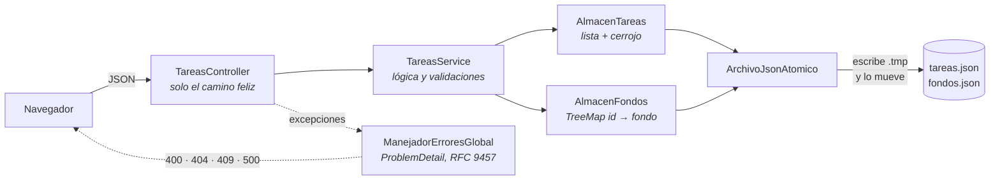
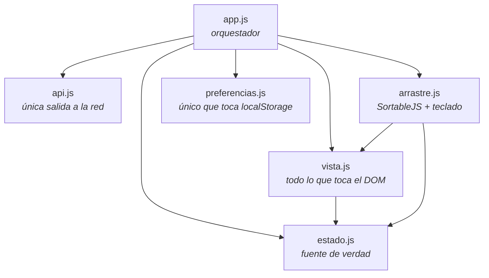

# Lista de tareas

[](https://github.com/AngelDanielC0des/ListaDeTareas_DragAndDrop/actions/workflows/build.yml)
[](#pruebas)
[](#pruebas)
[](LICENSE)

Gestor de tareas con **grupos**, reordenación por arrastre, búsqueda y filtros: **API REST en Java 21
con Spring Boot 4.1** y un frontend en HTML, CSS y JavaScript **sin framework ni paso de
compilación**. Los datos se guardan en archivos JSON; no hace falta base de datos.

<!--
	PENDIENTE, en dos pasos:

	1. Al desplegar, sustituir los dos DEMO_PENDIENTE de abajo por la URL real.
	2. Al grabar el GIF y las capturas (ver docs/LEEME.md), quitar estas dos líneas de comentario
	   para que se vean. Van comentadas a propósito: enlazar imágenes que aún no existen deja tres
	   iconos de imagen rota en la portada del repositorio, que es peor que no poner nada.


| Tema claro | Tema oscuro |
|---|---|
|  |  |
-->

**▶️ [Probar la demo](DEMO_PENDIENTE)** · **[Explorar la API](DEMO_PENDIENTE/swagger-ui.html)**

## Qué tiene de particular

Es una lista de tareas, que es el ejemplo más trillado que existe. Lo que puede merecer un rato de
lectura son las restricciones que se le pusieron encima y cómo se resolvieron:

- **Una tarea son exactamente tres campos** —`id`, `texto` y `completada`— y no se podía añadir
  ninguno más. Eso obligó a que el orden fuese la posición en el array, y a que **el fondo y el
  grupo** de cada tarea vivan en sus propios recursos en vez de ensanchar el modelo. La consecuencia buena es que **reordenar no cambia ningún
  `id`**, así que un `DELETE` que salió justo antes no acaba borrando otra tarea.
- **Sin paso de compilación en el frontend.** Los archivos que sirve Spring son los archivos fuente:
  sin `node_modules`, sin empaquetador, sin transpilar. Y aun así **los tipos se verifican en la
  integración continua**, declarados con JSDoc y comprobados por `tsc` en modo `checkJs`.
- **Sin base de datos, pero sin perder datos.** Cada cambio se escribe en un archivo temporal que
  después se mueve sobre el definitivo, de modo que un corte a mitad no deja un JSON truncado; si la
  escritura falla, el cambio se deshace también en memoria.
- **Tres ramas encadenadas** que permiten leer la evolución del proyecto por partes, en vez de
  encontrarse todo hecho de golpe.
- **Accesibilidad de verdad**, no un `alt` puesto por encima: [ver la sección](#accesibilidad).

## Las tres versiones

El proyecto vive en tres ramas encadenadas, cada una un paso más que la anterior, para poder leer la
evolución por partes.

| Rama | Qué añade | Dónde viven las tareas |
|---|---|---|
| `listatareasv0` | CRUD completo sobre la API REST | memoria |
| `listatareasv1` | persistencia entre arranques | archivo JSON |
| **`master`** ← estás aquí | arrastre, guardado automático, fondos, temas | archivos JSON |

```bash
git diff listatareasv0 listatareasv1   # lo que cuesta añadir la persistencia
git diff listatareasv1 master          # lo que cuesta añadir todo lo demás
```

## Requisitos

**Java 21.** Maven no hace falta: el proyecto trae su propio wrapper (`mvnw` en Linux y macOS,
`mvnw.cmd` en Windows), que se descarga la versión correcta la primera vez.

## Arrancar

```powershell
.\mvnw.cmd spring-boot:run
```

Y abrir <http://localhost:8080>. Si el puerto está ocupado:

```powershell
.\mvnw.cmd spring-boot:run "-Dspring-boot.run.arguments=--server.port=8081"
```

Pruebas:

```powershell
.\mvnw.cmd test
```

Para arrancar con el log detallado:

```powershell
.\mvnw.cmd spring-boot:run "-Dspring-boot.run.arguments=--spring.profiles.active=dev"
```

## Empaquetar y ejecutar

```powershell
.\mvnw.cmd clean package
java -jar target\tareas-0.0.1-SNAPSHOT.jar
```

**La interfaz web viaja dentro del jar**, así que no hay nada más que desplegar: con Java 21
instalado, ese archivo es la aplicación entera.

Cualquier propiedad se puede cambiar al arrancar, sin tocar el `application.properties`:

```powershell
java -jar target\tareas-0.0.1-SNAPSHOT.jar --server.port=9000 --app.almacen.ruta=C:\datos\tareas.json
```

> **Ojo con el directorio.** La ruta por defecto `datos/tareas.json` es **relativa al directorio
> desde el que se lanza**, no a donde esté el jar. Ejecutarlo desde otra carpeta crea el archivo en
> otra carpeta; si eso molesta, pásale una ruta absoluta como en el ejemplo de arriba.

## Cómo se usa

- **Añadir**: escribir arriba y pulsar Enter o el botón **+**. La tecla <kbd>n</kbd> enfoca el campo.
- **Completar**: marcar la casilla de la tarjeta.
- **Editar**: botón «Editar». Se guarda solo 500 ms después de dejar de escribir. <kbd>Enter</kbd>
  confirma, <kbd>Mayús</kbd>+<kbd>Enter</kbd> hace un salto de línea, <kbd>Escape</kbd> cancela.
- **Reordenar**: arrastrar por el asa ⠿, o con <kbd>Ctrl</kbd>+<kbd>↑</kbd>/<kbd>↓</kbd> teniendo el
  asa enfocada.
- **Ver texto completo**: botón «Ver más», que solo aparece si el texto está recortado.
- **Fondo**: botón «Fondo» de la tarjeta, que abre un selector con cinco imágenes o ninguna.
- **Borrar**: botón «Borrar». La tarea desaparece y quedan unos segundos para pulsar «Deshacer», que
  la devuelve a su posición exacta.
- **Tema**: claro, oscuro o el del sistema, con el selector de la cabecera. La elección se recuerda
  en este navegador.

## Grupos

Las tareas se agrupan en secciones con nombre —«Mañana», «Casa»— y cada grupo lleva su propia barra
de progreso, que avanza según se completan sus tareas. Las que no están en ninguno aparecen al final,
sueltas y sin barra: no son un conjunto que se pueda dar por terminado.

**El grupo no es un campo de la tarea**, y no podía serlo. Vive en `datos/grupos.json` junto con las
asignaciones, siguiendo el mismo patrón que los fondos. Los dos van en el mismo archivo porque por
separado no sirven de nada, y dos escrituras podrían dejar asignaciones apuntando a un grupo
inexistente.

**El orden tampoco se duplica:** dentro de un grupo, el orden de sus tareas es el orden relativo que
ya tienen en la lista global. No hay una segunda ordenación por grupo que mantener sincronizada.

Borrar un grupo **no borra sus tareas**: quedan sueltas. Un grupo es una forma de ordenar lo que hay,
no un contenedor del que las tareas dependan para existir.

## Buscar y filtrar

Con muchas tareas la lista se hace incómoda, así que hay un campo de búsqueda y tres estados: todas,
pendientes y completadas. La búsqueda **ignora tildes y mayúsculas**, porque quien escribe «anadir»
espera encontrar «añadir».

**Con un filtro puesto no se puede reordenar, y es a propósito.** Al ver solo parte de la lista, las
posiciones que ve el usuario no son las del estado: arrastrar la tercera tarjeta visible a la primera
no significa nada sobre el orden completo. Antes que inventar una correspondencia frágil, la
reordenación se desactiva y se explica en pantalla en lugar de dejar que el asa deje de responder sin
motivo aparente.

## Atajos de teclado

| Tecla | Qué hace |
|---|---|
| <kbd>n</kbd> | Escribir una tarea nueva |
| <kbd>/</kbd> | Buscar entre las tareas |
| <kbd>Ctrl</kbd> + <kbd>↑</kbd> / <kbd>↓</kbd> | Mover la tarea dentro de su grupo, con el foco en su asa |
| <kbd>Ctrl</kbd> + <kbd>←</kbd> / <kbd>→</kbd> | Cambiar la tarea de grupo sin usar el ratón |
| <kbd>Intro</kbd> | Confirmar la edición |
| <kbd>Mayús</kbd> + <kbd>Intro</kbd> | Salto de línea dentro de una tarea |
| <kbd>Esc</kbd> | Cancelar la edición o cerrar una ventana |
| <kbd>?</kbd> | Abrir la ayuda de atajos |

La misma lista está dentro de la aplicación, en un `<dialog>` que se abre con <kbd>?</kbd> o desde el
enlace del pie: un atajo que nadie sabe que existe es un atajo que no existe.

## La API

Todo se recibe y se devuelve en JSON.

| Método | Ruta | Cuerpo | Respuesta |
|---|---|---|---|
| `GET` | `/tarea` | — | `200` con las tareas en orden |
| `GET` | `/tarea/{id}` | — | `200` · `404` si no existe |
| `POST` | `/tarea` | `{"texto":"…"}` | `201` + `Location`, se añade al final |
| `PUT` | `/tarea/{id}` | `{"texto":"…","completada":false}` | `200` · `404` si no existe |
| `PATCH` | `/tarea/{id}/completada` | `{"completada":true}` | `200` · `404` si no existe |
| `DELETE` | `/tarea/{id}` | — | `204` · `404` si no existe |
| `PUT` | `/tarea/orden` | `{"ids":[3,1,2]}` | `200` · `409` si no es una permutación exacta |
| `GET` | `/tarea/fondo` | — | `200` con `{id: fondo}` de las tareas que tienen uno |
| `PUT` | `/tarea/{id}/fondo` | `{"fondo":"ondas"}` | `200` con el mapa actualizado · `404` si no existe |
| `GET` | `/tarea/configuracion` | — | `200` con los límites del servidor |

Una tarea tiene **exactamente tres campos**:

```json
{ "id": 1, "texto": "Repasar HTML", "completada": false }
```

Los errores usan siempre el formato `ProblemDetail` (RFC 9457):

```json
{
  "type": "urn:tareas:error:validacion",
  "title": "Datos inválidos",
  "status": 400,
  "detail": "Revisa los campos indicados en la propiedad «errores».",
  "errores": { "texto": "El texto de la tarea no puede estar vacío" }
}
```

## Dónde se guardan los datos

En `datos/`, relativo al directorio desde el que se arranca la aplicación. Los archivos se crean
solos la primera vez que hacen falta. Las rutas se cambian en `application.properties`:

```properties
app.almacen.ruta=datos/tareas.json
app.almacen.ruta-de-fondos=datos/fondos.json
```

`tareas.json` es un array donde **el orden del array es el orden de la lista**:

```json
[
  { "id" : 1, "texto" : "Repasar HTML", "completada" : false },
  { "id" : 2, "texto" : "Repasar CSS", "completada" : true }
]
```

`fondos.json` asocia cada tarea con su imagen, **en un archivo aparte a propósito**: así una tarea
conserva exactamente sus tres campos y la decoración no se mezcla con los datos.

```json
{ "2" : "aurora" }
```

La escritura es **atómica**: se guarda en un archivo temporal y luego se mueve sobre el definitivo,
así que un corte a mitad no deja el archivo truncado. Si la escritura falla, el cambio se deshace
también en memoria para que las dos no se desincronicen.

## Arquitectura

Tres capas en el servidor, sin repository porque no hay base de datos: el almacén es el guardián del
estado compartido y de la escritura en disco.



En el navegador, seis módulos con una responsabilidad cada uno. `estado.js` es la única fuente de
verdad: el DOM siempre es una proyección suya, nunca se le pregunta qué hay ni en qué orden.



## Estructura

```
src/main/java/angel/xtd/tareas/
├── TareasApplication.java             arranque
├── controller/TareasController.java   API REST: solo el camino feliz, sin un try/catch
├── service/TareasService.java         lógica de negocio
├── almacen/AlmacenTareas.java         las tareas en memoria + escritura atómica
├── almacen/AlmacenFondos.java         TreeMap<id, fondo> en su propio archivo
├── almacen/ArchivoJsonAtomico.java    la E/S compartida por los dos almacenes
├── dto/                               Tarea (3 campos), Fondo y los cuerpos de petición
├── error/                             excepciones de dominio + el @RestControllerAdvice
└── config/                            rutas, portada de OpenAPI y datos de la demo

src/main/resources/
├── application.properties             configuración
├── application-demo.properties        perfil de la demostración pública
├── messages.properties                traduce al español los errores del framework
└── static/
    ├── index.html                     HTML semántico + <template> de la tarjeta
    ├── css/estilos.css                especificidad plana, BEM, mobile first
    ├── img/                           las 5 imágenes de fondo
    └── js/
        ├── api.js          única puerta hacia la API; interpreta los errores
        ├── tipos.js        typedefs compartidos; no se carga en el navegador
        ├── preferencias.js único sitio que toca localStorage (solo el tema)
        ├── estado.js       única fuente de verdad del cliente
        ├── vista.js        todo lo que toca el DOM
        ├── arrastre.js     SortableJS + reordenación por teclado
        └── app.js          orquestador

src/test/js/                               pruebas del frontend con Vitest
├── estado.test.js                     la lógica, sin DOM
├── api.test.js                        errores y ProblemDetail, con fetch simulado
├── preferencias.test.js               incluido el localStorage que lanza
└── vista.test.js                      carga el index.html real en jsdom

src/test/java/angel/xtd/tareas/
├── TareasApplicationTest.java             que el contexto de Spring arranca
├── almacen/AlmacenTareasTest.java         la E/S: rollback y archivo intacto si falla
├── almacen/AlmacenFondosTest.java         la asociación tarea → fondo
├── controller/TareasControllerTest.java   el contrato HTTP, con el servicio simulado
├── service/TareasServiceTest.java         la lógica, contra un archivo temporal
└── RecursosEstaticosTest.java             que el HTML y el servidor no se contradigan
```

`AlmacenTareas` y `AlmacenFondos` **no son repositories**: no hay ORM ni base de datos. Son los
guardianes del estado compartido y de la escritura, separados del servicio para que el `Files.move` y
el `ObjectMapper` no entierren la lógica de negocio.

## Por qué está hecho así

Las decisiones que no se deducen leyendo el código.

### El `id` es identidad; el orden es la posición

El `id` no cambia nunca y el orden es la posición dentro del array del JSON, así que la tarea no
necesita ningún campo de orden. **Renumerar los ids al arrastrar rompería la identidad**: si el
navegador tuviera un `DELETE /tarea/1` en vuelo, ese borrado acabaría aplicándose a otra tarea.

Reordenar es una sola petición atómica, `PUT /tarea/orden`, y el servidor comprueba que lo recibido
es una **permutación exacta** de lo que tiene: ni repetidos, ni ids desconocidos, ni tareas que se
quedan fuera. Sin esa comprobación, un cliente con la lista desactualizada podría borrar tareas sin
querer al reordenar.

### `ArrayList`, no `TreeMap`, para las tareas

Con el orden como posición, la clave de un mapa sería un entero denso (0..N‑1), que es justo la
definición de un array. Además la operación estrella —mover una tarea— es la peor para un árbol:
O(n·log n) reasignando claves frente a O(n) de un `System.arraycopy`.

No se implementa `Comparable`: sirve para ordenar **según los datos**, pero el arrastre ordena
**según el usuario**, que no es un criterio calculable a partir de los campos de la tarea.

### El id sale de un contador, no del tamaño de la lista

Con `size()` habría colisiones: crea tres tareas (1, 2, 3), borra la 2 y la siguiente recibiría el
id 3, machacando una existente. Hay un test de regresión.

### El fondo vive fuera de la tarea

Una tarea son tres campos y así se queda, así que el fondo se guarda como un `TreeMap<Integer, Fondo>`
en su propio archivo. Va **en el servidor y no en el navegador** porque no es una preferencia de
vista: si eliges un fondo en el ordenador, esperas verlo también en el móvil.

Es un `TreeMap` para que los ids salgan ordenados en el archivo y las diferencias se lean bien.
Elegir «ninguno» borra la entrada en vez de guardarla, al borrar una tarea se olvida su fondo, y al
arrancar se descartan los huérfanos por si el proceso murió entre las dos escrituras.

**El fondo se pinta en un pseudoelemento por debajo del contenido**, no como `background` de la
tarjeta: es lo que permite bajarle la opacidad sin atenuar el texto, que es lo que mantiene el
contraste en nivel AA.

### Qué se guarda en el navegador

`localStorage` guarda **una sola cosa**: el tema. Las tareas no, porque el servidor es su fuente de
verdad y duplicarlas crearía una segunda que habría que mantener sincronizada.

El tema se aplica desde un script en línea en el `<head>` y no desde un módulo: los módulos se
ejecutan después del primer pintado, así que leerlo más tarde produciría un fogonazo del tema claro.

### Borrar se puede deshacer, y por eso la petición se retrasa

En vez de un `confirm()` que bloquea, la tarea desaparece y quedan unos segundos para rectificar.
**El `DELETE` se retrasa a propósito**: mandarlo de inmediato y «deshacer» creando la tarea otra vez
le daría un id nuevo y la dejaría al final de la lista, no en su sitio. Si cierras la pestaña con un
borrado a medias, se envía con `keepalive`.

### Los errores se traducen en un solo sitio

`ManejadorErroresGlobal` extiende `ResponseEntityExceptionHandler`, que es el punto de extensión que
Spring diseñó para esto: la autoconfiguración de Boot lleva `@ConditionalOnMissingBean`, así que al
declarar la subclase la de Boot se aparta y esta atiende tanto las excepciones del dominio como las
del framework. Los textos de estas últimas se traducen en `messages.properties`.

El controlador no tiene **ni un `try/catch`**: escribe solo el camino feliz.

### El estado del cliente vive en una variable, no en el DOM

El DOM es siempre una proyección del estado, nunca al revés. Los cambios se pintan antes de que
conteste el servidor, pero si lo rechaza se deshacen y se avisa, y las respuestas que llegan fuera de
orden se descartan con un testigo de secuencia.

### El atributo `hidden` hay que reafirmarlo en el CSS

El navegador oculta lo marcado con `hidden` mediante una regla de su propia hoja de estilos, y
**cualquier `display` que declare el autor le gana**. Como `.tarea__texto` lleva `-webkit-box` para
el recorte, sin una regla `[hidden] { display: none !important; }` al editar se verían a la vez el
párrafo y el cuadro de edición. Es la única excepción al «sin `!important`» del proyecto.

## Accesibilidad

Cada botón dice **de qué tarea es** mediante `aria-label`; sin eso, un lector de pantalla recorrería
la lista diciendo «Borrar, botón» sin nombrar nunca la tarea. Hay enlace de salto al listado, región
`aria-live` que anuncia los cambios, `aria-expanded` en «Ver más», iconos con `aria-hidden` y
devolución del foco tras borrar y tras deshacer.

El selector de fondo es un `<dialog>` nativo: trae el foco atrapado, el cierre con Escape y la
devolución del foco al botón que lo abrió, sin ARIA escrita a mano.

## Diseño e interfaz

Hay tema claro y oscuro con un interruptor de dos estados: al arrancar sigue al del sistema, y en
cuanto se pulsa esa elección manda.

Las tareas van **en una sola columna**, agrupadas en secciones. Antes eran una rejilla de 2 a 4
columnas, y se cambió al añadir los grupos: agrupar y encolumnar compiten, porque una rejilla con
pocas tareas por grupo deja filas a medias. Cada tarjeta toma su altura natural y el texto se recorta
a 2 líneas hasta que se despliega.

Las completadas **no se tachan**: se atenúan en su sitio y se marca su casilla. Tachar dificulta
releer lo que ya está hecho, que es justo lo que se quiere poder hacer al repasar.

Por debajo de 480 px las acciones de la tarjeta se quedan solo con su icono: con dos columnas la
tarjeta mide unos 142 px y tres botones con su palabra no caben. El nombre para lectores de pantalla
no cambia, porque lo aporta el `aria-label`.

El CSS sigue tres reglas: **especificidad plana** (una sola clase por selector, sin ids ni
anidamiento), nomenclatura **BEM**, y todo color, espacio y radio sale de una variable de `:root`.

### Cambiar las imágenes de fondo

Están en `src/main/resources/static/img/` como cinco SVG. Para poner las tuyas basta con sustituir
esos archivos manteniendo el nombre; si usas otro formato, hay que cambiar la extensión en las cinco
reglas `.tarea--fondo-*` de `estilos.css` y en `abrirSelectorDeFondo` de `vista.js`.

## Docker

```bash
docker build -t tareas .
docker run --rm -p 8080:8080 -v tareas-datos:/datos tareas
```

La imagen se construye en dos etapas, de modo que la final solo lleva un JRE y el jar: ni Maven ni
el código fuente. El proceso corre con un usuario sin privilegios y los archivos JSON se escriben en
`/datos`, que es donde conviene montar un volumen para que sobrevivan al contenedor.

## Documentación de la API

Con la aplicación arrancada:

- **`/swagger-ui.html`** — interfaz para leer y **probar** los diez endpoints desde el navegador.
- **`/v3/api-docs`** — el esquema OpenAPI en JSON.

Se genera con [springdoc](https://springdoc.org/) a partir de las anotaciones que ya lleva el
controlador, así que no hay un segundo documento que se pueda quedar desactualizado.

## Tipos del frontend, sin compilar nada

El JavaScript no se transpila ni se empaqueta: lo que sirve Spring es exactamente lo que hay en
`static/js/`. Pero los tipos sí se comprueban, declarados con JSDoc y verificados por TypeScript en
modo `checkJs` (`jsconfig.json`):

```bash
npm install     # solo TypeScript, y solo como dependencia de desarrollo
npm run tipos   # comprueba; es lo que ejecuta la integración continua
```

VS Code lo aplica solo al abrir el proyecto, así que los errores salen subrayados mientras escribes.
Se eligió esto en vez de migrar a TypeScript para conservar el «se abre y funciona» sin renunciar a
la comprobación de tipos.

## Pruebas

**192 pruebas**: 106 del servidor y 86 del navegador.

```bash
.\mvnw.cmd verify   # las de Java, más el informe de cobertura
npm test            # las del frontend
```

Las del servidor cubren el **83 % de las líneas y el 76 % de las ramas**; el informe de JaCoCo queda
en `target/site/jacoco/index.html`. No hay umbral que rompa la construcción a propósito: perseguir un
porcentaje lleva a escribir pruebas que no comprueban nada.

Las del navegador viven en `src/test/js/` —**fuera de `static/`, que es lo que se publica**— y usan
Vitest. Las de `vista.js` **cargan el `index.html` de verdad** en jsdom, así que si alguien renombra
una clase de la plantilla, la prueba falla igual que fallaría la aplicación. Las de `estado.js`,
`api.js` y `preferencias.js` no necesitan DOM.

Lo que sí se vigila en las dos suites es que cada prueba **pueda fallar de verdad**. Hay alguna cuyo
único trabajo es demostrar que el patrón de búsqueda de otra encuentra algo, y las de regresión se
comprobaron reintroduciendo el fallo para ver que saltaban.

## Integración continua

Cada empujón dispara un workflow de GitHub Actions (`.github/workflows/build.yml`) con dos trabajos
en paralelo: uno compila y ejecuta los tests en Ubuntu con Java 21, y otro comprueba los tipos del
frontend.

## Dependencias

En el servidor, Spring Boot más [springdoc](https://springdoc.org/) para publicar el OpenAPI. En el
navegador, **una sola**:
[SortableJS](https://github.com/SortableJS/Sortable) 1.15.7 (MIT), vendorizada en
`static/js/vendor/` para que la aplicación funcione sin conexión y sin paso de compilación. Se
descartó hacer el arrastre a mano porque hay **varias listas conectadas** —una por grupo— entre las
que se puede mover una tarjeta, con autoscroll y sin confundir el arrastre con un scroll táctil.
Resolver eso a mano es bastante más que comparar una coordenada.
